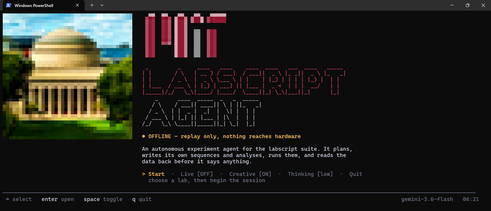
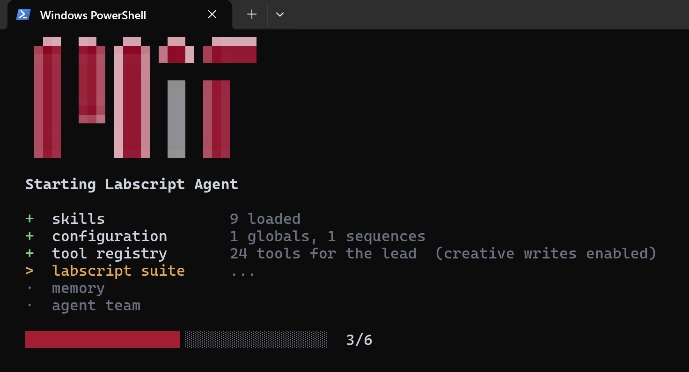
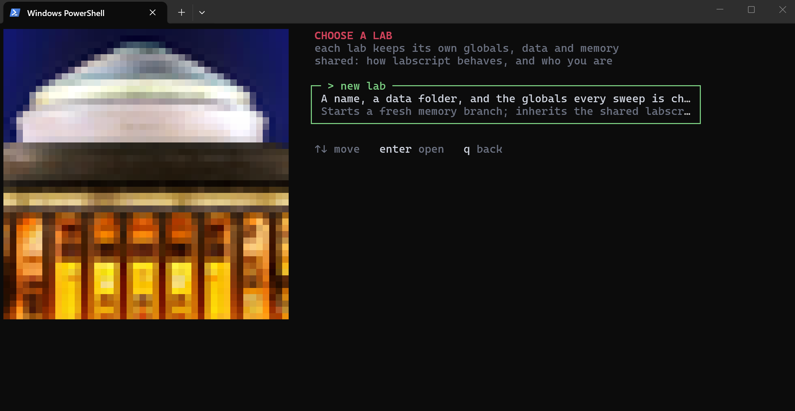
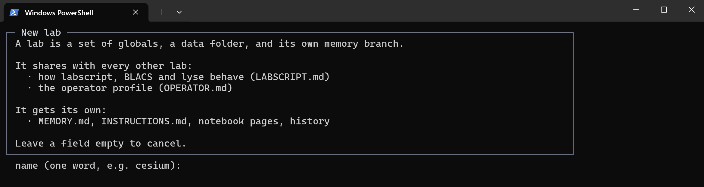
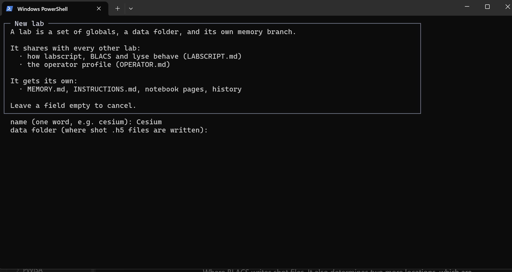
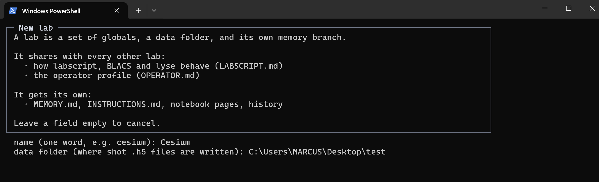
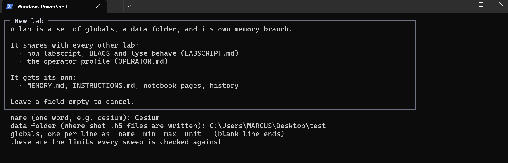
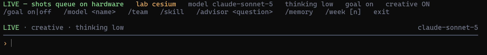

# Labscript Agent

An agent team (lead / planner / coder / advisor) that runs labscript-suite
experiments: it reads runmanager globals, queues shots, reads the results back,
and — in creative mode — writes its own shot sequences and analysis routines,
with every write shown to the operator before it touches disk.

This checkout ships with **no apparatus configured and no lab data**. Everything
below takes it from a fresh clone to a running session. Replace every `<...>`
with your own value.

---

## 1. Python environments

**You need two, and they must stay separate.** The agent never imports labscript —
it reaches runmanager and lyse by launching the suite's own interpreter as a
subprocess. Their dependencies are mutually incompatible.

| | Agent env | Labscript-suite env |
|---|---|---|
| Python | **3.11+** (verified on 3.11.15) | **3.8** (verified on 3.8.20) |
| Purpose | the agent itself | runmanager / BLACS / lyse |
| Installed from | `requirements.txt` | the labscript-suite install guide |
| numpy | **2.4.6** | **1.24.3** |
| pandas / scipy / h5py | 3.0.5 / 1.17.1 / 3.16.0 | 2.0.3 / 1.10.1 / 3.11.0 |
| Must NOT contain | labscript, runmanager, blacs, lyse | the agent's packages |

**Why separate:** numpy 2.4 and 1.24 cannot coexist. Installing labscript into
the agent's env breaks both.

### Agent env packages

| Package | Verified version | Needed for |
|---|---|---|
| numpy | 2.4.6 | numerics |
| h5py | 3.16.0 | reading shot files |
| pandas | 3.0.5 | results tables |
| scipy | 1.17.1 | fitting |
| matplotlib | 3.11.1 | figures |
| pydantic | 2.13.4 | schemas |
| **google-genai** | 2.13.0 | Gemini **and all embeddings** |
| **anthropic** | 0.120.2 | Claude models |
| requests | 2.34.2 | the advisor's web fetch |
| python-dotenv | 1.2.2 | reading `.env` |

`google-genai` is required **even if you only use Claude** — knowledge retrieval
embeds with Gemini regardless of which model the team runs on.

### Labscript-suite env packages

Installed as **editable** git checkouts (`pip install -e`), not as wheels:

| Package | Version |
|---|---|
| labscript / labscript-utils / labscript-devices | 3.5.0.dev20 / 3.5.0.dev30 / 3.4.0.dev15 |
| runmanager / blacs / lyse | 3.4.0.dev36 / 3.3.0.dev52 / 3.4.0.dev19 |
| PyQt5 / pyqtgraph / qtutils | 5.15.10 / 0.13.1 / 4.1.3 |
| PyVISA / PyVISA-py / zprocess | 1.16.2 / 0.7.2 / 2.25.0 |

---

## 2. Create the agent environment

Run these one at a time.

```bash
conda create -n labscript-agent python=3.11 -y
```

```bash
conda activate labscript-agent
```

```bash
cd "<path-to-your-clone>/SuperradiantAssistant"
```

```bash
pip install -r requirements.txt
```

**Windows note:** typing bare `python` may hit the Microsoft Store stub, which
cannot install packages. Either `conda activate` first (as above), or call the
interpreter by full path:
`C:\Users\<you>\anaconda3\envs\labscript-agent\python.exe`

Verify:

```bash
python -c "import numpy, h5py, pandas, scipy, anthropic, google.genai; print('ok')"
```

---

## 3. One-time configuration

Four commands, from inside `SuperradiantAssistant`. PowerShell syntax.

**a. Create `.env` from the template**

```bash
copy .env.example .env
```

**b. Create the data folder** — it is **not** created for you, and a missing one
fails silently as "0 shots found"

```bash
mkdir "<absolute-path-to-your-clone>\local_data"
```

**c. Create `config.json`**

Skip this if you plan to use the **new lab** screen (section 7), which writes the
config for you. Only do it to hand-write one:

```bash
copy config.json.example config.json
```

Then edit `config.json`:

| Field | Fill in with |
|---|---|
| `MEMORY_DATA_PATH` | `local_data` — a **relative** path, resolved against the folder *containing* the repo. Survives renaming or moving the project. |
| `LABSCRIPT_SUITE_PATH` | leave `""` to fall back to `~/labscript-suite` |
| `globals` | every parameter this apparatus has, with **real** min/max. Every sweep is range-checked against this list, and a global absent from it cannot be swept at all. |
| `sequences` / `analysis_scripts` | the whitelists of files the agent may use. Empty means no sequence can run. |

**Do not save `config.json` as UTF-8 with BOM.** `json.load` rejects a BOM, the
config falls back to defaults silently, and you get zero globals with no visible
error. PowerShell's `Set-Content -Encoding utf8` adds a BOM on Windows
PowerShell 5.1 — use an editor set to "UTF-8 without BOM".

**d. Verify it parses**

```bash
python -c "from superradiant_assistant.config import CONFIG; print(CONFIG.historical_data_root, len(CONFIG.experiment_globals), 'globals')"
```

---

## 4. API keys

Open `.env` in a text editor and fill in the key(s) you have:

```
GEMINI_API_KEY=<your-gemini-key>
ANTHROPIC_API_KEY=<your-anthropic-key>
```

| Key | Get it from | Needed for |
|---|---|---|
| `GEMINI_API_KEY` | aistudio.google.com/apikey | `gemini-*` models, **and all knowledge retrieval** |
| `ANTHROPIC_API_KEY` | console.anthropic.com | `claude-*` models; the advisor is pinned to `claude-opus-5` |

Either key alone is enough to start a session. Keep the Gemini key even on a
Claude-only setup — retrieval embeds with Gemini.

**The keys must be in `.env`, not in `config.json`** — the client reads them from
the environment only.

`.env` is git-ignored. Never commit it.

---

## 5. First run

```bash
python agent.py --creative
```

Common flags:

| Flag | Effect |
|---|---|
| `--creative` | let the agent write its own shots and analyses. Every write still needs your confirmation. |
| `--live` | queue shots on **real hardware**. Requires runmanager, BLACS and lyse already running. |
| `--model <name>` | any `gemini-*` or `claude-*` model. Defaults: `gemini-3.6-flash`, or `claude-opus-5` for Claude. |
| `--apparatus <name>` | load `config.<name>.json` instead of the default |
| `--thinking <level>` | `minimal` / `low` / `medium` / `high`. Default `low`. |
| `--no-splash` | skip the boot screen |
| `"your question"` | one-shot: answer and exit |

---

## 6. The boot screen

Navigate with **↑↓**, **enter** to open or toggle, **q** to quit.


| Item | Type | What it does |
|---|---|---|
| **Start** | action | choose a lab, then begin the session |
| **Live** | toggle | **ON** — queue shots on real hardware. **OFF** — replay history, nothing reaches hardware. |
| **Creative** | toggle | let the agent write its own shots and analyses |
| **Thinking** | cycle | how hard the model deliberates before each tool call: `minimal` → `low` → `medium` → `high` |
| **Quit** | action | exit without starting |

There is deliberately no Memory item here: memory belongs to one lab, and no lab
has been chosen yet. Use `/memory` once a session is open.

### The six loading steps after Start

`skills` → `configuration` → `tool registry` → **`labscript suite`** → `memory`
→ `agent team`

**Make sure runmanager, BLACS and lyse are running and connected *before* you
press Start with Live ON.** Step 4 spawns a subprocess and waits on a socket; if
the suite is not up, the bar **stalls at 3/6**. With Live OFF this step is
skipped with "offline — replaying history".



A live session also needs the suite **patched** — stock lyse cannot load an
analysis routine remotely, so `set_lyse_routines` silently does nothing. See
section 9.

---

## 7. Creating a lab

On a fresh clone there is no config, so the lab screen offers only **new lab**.
Three fields, asked in order. **Leaving any of the first two empty cancels
everything** — no file is written.

### `name (one word, e.g. cesium)`

The lab's identifier and its config filename.

- Must be alphanumeric after removing `_` and `-`. `cesium`, `yb_clock`, `test-2`
  are fine; `my lab` and `rb@87` are rejected as invalid → cancels.
- **Lowercased automatically.**
- `testbench` → `config.json`. Anything else → `config.<name>.json`.
- A name that already exists is refused: pick it on the Lab row instead.

### `data folder (where shot .h5 files are written)`



Where BLACS writes shot files. It also determines two more locations, which are
**siblings of it, not inside it**:

```
<data folder>/..
├── <data folder>/     ← shot .h5 files
├── agent_memory/      ← MEMORY.md, notebook pages, history
└── reports/           ← written reports
```

**Use a relative path.** It is resolved against the folder *containing* the repo,
so renaming or copying the project keeps working. An absolute path is accepted,
but if it does not exist it silently falls back to a same-named folder beside the
repo.

**The folder is NOT created for you.** Nothing in this flow creates it — only
`agent_memory` is created. A missing data folder returns an empty shot list
without raising, so the symptom is `read 0 shots | no .h5 files found`, which
reads like "no experiments yet" rather than "your path is wrong". Create it
yourself (section 3b) or let BLACS create it on its first write.

### `globals, one per line as  name  min  max  unit`

**The field that matters.** These are the limits every sweep is checked against.

Space-separated, one per line, **at least three parts**:

```
waveplate_angle 0 360 deg
sine_frequency 1000 25000 Hz
amplitude 0 1.0
```

`unit` is optional — and currently stored but read by nothing, so it is
documentation only.

- Fewer than 3 parts → `need at least: name min max`, that line is re-asked
- min/max not numbers → `min and max must be numbers`, that line is re-asked
- **A blank line ends the list** — here a blank line means "done", **not** cancel
- Leaving it entirely empty is allowed, and prints:
  `NOTE: no globals declared, so no sweep can be range-checked.`
  That warning is literal: safety bounds are then completely inactive.

### What happens on completion

1. writes `config.<name>.json` (with `MEMORY_DATA_PATH`, `globals`, and **empty**
   `sequences` / `analysis_scripts`)
2. switches the current lab to the new one
3. creates the memory branch and today's notebook page
4. prints the memory-branch and shared-memory paths

**`sequences` and `analysis_scripts` are left empty**, and this flow does not ask
for them. Until you add them to the config by hand, no sequence can run. The
screen does not mention this.

### Per-lab vs shared

| Each lab gets its own | Shared by every lab |
|---|---|
| `MEMORY.md` — apparatus facts | `LABSCRIPT.md` — how labscript/BLACS/lyse behave |
| `INSTRUCTIONS.md` — this bench's rules | `OPERATOR.md` — the operator profile |
| notebook pages, history, reports | |

So a new lab starts with fresh apparatus memory but **inherits** the accumulated
labscript know-how and your personal preferences.

---

## 8. In-session commands

Anything not starting with `/` is a message to the lead agent.

| Command | What it does |
|---|---|
| `/team` | show the four agents and each one's tools |
| `/skill` (or `/skills`) | browse the installed skills — ↑↓ to move, q to leave. Shows each skill's size, and marks any written for another apparatus. |
| `/memory` | show what is currently in memory for this lab |
| `/advisor <question>` | consult the physics advisor directly. It reads shots, the notebook, past reports, the knowledge base and the web; it cannot touch hardware. Pinned to `claude-opus-5`. |
| `/goal on` \| `/goal off` | goal mode. **on**: iterate until the threshold is met. **off**: one attempt, then report. |
| `/model <name>` | switch the team's model, e.g. `/model claude-opus-5`. The advisor stays pinned — move it with `/team`. |
| `/week [n]` | write one page summarising the last `n` days of notebook pages (default 7) |
| `exit` | quit the session |

Nothing on the `/skill` screen executes anything — a skill's body only enters the
model's context when it is loaded.

---

## 9. Patching the labscript suite

**Only needed for `--live`.** Everything offline — reading old shots, creative
writing, the advisor — works against a stock suite.

### 9.1 Why the suite has to be patched

Stock lyse's remote API accepts exactly four requests: `hello`, `get dataframe`,
and two forms of "add this shot". **There is no remote call to add or enable an
analysis routine.** So the agent writes a perfectly good analysis, and then waits
for results that were never going to come.

Which tools depend on which change:

| Agent tool | Needs | Without it |
|---|---|---|
| `set_lyse_routines` | lyse `communication.py` patch | **the tool cannot work at all** — lyse falls through to its "assume it's a filepath" branch and replies as if a shot were submitted, which reads as success |
| `get_lyse_routines` | lyse `communication.py` patch | returns `None`; the agent cannot confirm what is loaded |
| `run_sweep` (readiness check) | `get_lyse_routines` | cannot warn "lyse has no routine loaded", so a sweep silently produces shots nothing analyses |
| `write_analysis` → actually running | `set_lyse_routines` | the file is written but never loaded. Writing is not loading. |
| any routine calling `plt.figure('name')` | lyse `analysis_subprocess.py` patch | `ValueError` inside window setup kills the whole analysis — a working routine looks broken purely for having titled its plot |
| `analyze_results`, multishot fits | lyse `dataframe_utilities.py` patch | `data()` raises on newer tzlocal |
| `read_shot_results`, `inspect_shot` | RigolScope trace guards | a stale, clipped or never-triggered trace returns a plausible number instead of an error |
| `load_sequence`, `run_sweep` | the custom device drivers | the connection table will not import |
| any compilation | `labscriptlib/<Apparatus>/__init__.py` | fails with `KeyError: 'labscriptlib'`, which never mentions the missing file |

**runmanager, BLACS, labscript, labscript-utils and runviewer need no changes.**
The agent drives runmanager entirely through its stock `runmanager.remote` API —
`set_globals`, `engage`, `set_globals_and_engage`, `set_labscript_file`,
`get_globals`, `n_shots`. Do not go looking for patches to them.

### 9.2 How it was done on this machine

All suite packages are **editable** installs (`pip install -e`) from git
checkouts under `~/labscript-suite/`. That is what makes patching possible.

**a. `lyse/lyse/communication.py`** — add four request handlers to `WebServer`

Inside the request dispatch chain, before the generic `isinstance(request_data,
dict)` branch, add:

```python
elif isinstance(request_data, dict) and 'singleshot_routines' in request_data:
    from qtutils import inmain_later
    from qtutils.qt import QtCore
    entries = request_data['singleshot_routines']
    replace = bool(request_data.get('replace', False))
    box = self.app.singleshot_routinebox
    routine_files = [
        (str(path), QtCore.Qt.Checked if enabled else QtCore.Qt.Unchecked)
        for path, enabled in entries
    ]
    inmain_later(box.add_routines, routine_files, replace)
    return 'singleshot routines queued'

elif request_data == 'get singleshot routines':
    from qtutils import inmain
    box = self.app.singleshot_routinebox
    return inmain(lambda: [r.filepath for r in box.routines])
```

and the identical pair for `multishot_routines` / `'get multishot routines'`
against `self.app.multishot_routinebox`.

**b. `lyse/lyse/analysis_subprocess.py`** — two lines, same fix in both places

```python
# was: f"windowGeometry-{self.identifier:d}"
f"windowGeometry-{self.identifier}"
```

`:d` assumed the identifier was a figure *number*. A named figure makes it a
string, `:d` raises, and the exception escapes through `new_figure`. The save
site and the restore site must use the same key, so change both.

**c. `lyse/lyse/dataframe_utilities.py`** — make `asdatetime` tolerant

```python
try:
    tz = tzlocal.get_localzone()
    return pandas.Timestamp(timestr, tz=tz)
except (AttributeError, TypeError):
    return pandas.Timestamp(timestr)
```

**d. The scope driver** (here: `labscript_devices/RigolScope/blacs_workers.py`)
— make the worker **refuse** a trace it cannot vouch for, instead of returning a
number:

- *never triggered* — armed with `:SING` on a DC level. `:SING` waits for a real
  trigger event and ignores the sweep mode even when the panel says AUTO, so the
  scope returns the previous buffer forever. Raise, naming the reason.
- *identical to the previous trace* — the same stale-buffer failure, caught by
  comparing against the last trace.
- *still clipped* — detected from the digitiser **codes** (0 and full-scale are
  the screen edges), **not** from `:MEAS:VMAX?`, which returns Rigol's `9.9e37`
  sentinel exactly when the trace is clipped.

**e. Custom device drivers** — each needs the four standard entry points:
`labscript_devices.py`, `blacs_tabs.py`, `blacs_workers.py`,
`register_classes.py`.

**f. `userlib/labscriptlib/<Apparatus>/__init__.py`** — must exist, may be empty.

### 9.3 The core idea, in five rules

These are what to preserve when the code below does not match your version.

1. **Extend the GUI's own remote API; never edit its state behind its back.**
   The routine list lives in lyse's Qt model. Asking lyse to change it keeps its
   window truthful. Writing its config file instead leaves the GUI showing
   something else.
2. **Thread discipline: `inmain_later` to write, `inmain` to read.**
   `add_routines` touches Qt models and must run on the main thread, and the
   request handler is not on it. *Waiting* for the main thread blocks until it is
   free — while analysis is running, long enough for the client to time out and
   lyse to look unreachable. So writes are fire-and-forget, reads block (cheap),
   and the caller **confirms by reading back**.
3. **A missing patch must not look like success.** An unpatched lyse answers
   `experiment added successfully`. The agent keeps a guard list
   (`_STALE_LYSE_REPLIES` in `interfaces/lyse_iface.py`) so that reply is
   reported as a failure. Any new handler you add needs the same treatment: if
   the old code path can answer plausibly, detect it.
4. **A driver should refuse, not estimate.** Every silent-failure mode above
   returned a plausible number. Raising with the reason costs one shot; a
   plausible number costs a day and a wrong conclusion.
5. **Cross the environment boundary as a subprocess, never as an import.** The
   agent's Python 3.11 spawns the suite's 3.8 and exchanges JSON on
   stdin/stdout (`scripts/runmanager_bridge.py`, `scripts/lyse_bridge.py`). This
   is why the two envs can hold incompatible numpy versions.

### 9.4 On a different machine or a different suite version

**The code above may not apply as written.** The attribute names
(`self.app.singleshot_routinebox`), the dispatch structure in
`communication.py`, and the scope driver's internals all move between suite
versions, and your hardware is different anyway.

What transfers is **9.1 (the goals) and 9.3 (the rules)**, not the diffs.

The practical route is to hand those to Claude Code inside your own
labscript-suite checkout:

> This is a labscript-suite installation. I need lyse's remote API to accept
> four more requests, so an agent can load analysis routines without a person
> clicking through the GUI:
> `{'singleshot_routines': [[path, enabled], ...], 'replace': bool}`,
> `'get singleshot routines'`, and the same pair for multishot.
>
> Constraints: go through lyse's own routine box so its GUI stays correct; use
> `inmain_later` for the setters (waiting on the main thread deadlocks while
> analysis runs) and blocking `inmain` for the getters; return a distinct string
> so an unpatched server cannot be mistaken for a patched one.
>
> Also: `analysis_subprocess.py` formats the plot-window settings key with `:d`,
> which crashes on a *named* figure — fix both the save and the restore site.
> And `asdatetime` in `dataframe_utilities.py` breaks on newer tzlocal.
>
> Tell me the version you are working against, and show me the diff before
> applying it.

Then verify with the checks in 9.5 rather than trusting that it applied.

### 9.5 Verifying the patch is live

| Check | Pass | Fail |
|---|---|---|
| Start lyse, run `get_lyse_routines` | a list, even empty | `experiment added successfully` — that is the **stock** filepath branch; the patch is not live |
| Load a routine containing `plt.figure('some name')` | analysis completes | dies during window setup |
| Pause the scope on its front panel, engage a shot | `RuntimeError` naming the reason | a stale trace returned as data |
| Import the custom drivers | `drivers OK` | `ImportError` |

```bash
python -c "from labscript_devices.RigolScope.labscript_devices import RigolScope; print('drivers OK')"
```

### 9.6 Keep the patches somewhere safe

On this machine the lyse and scope-driver changes are **uncommitted working-tree
edits**. A `git checkout`, `git stash` or `git pull` in either repo destroys
them. Commit them to a fork, or export them:

```bash
cd ~/labscript-suite/lyse
git diff > 01-lyse-remote-routine-api.patch
```

---

## Troubleshooting

| Symptom                                                   | Cause                                                                                                          |
| --------------------------------------------------------- | -------------------------------------------------------------------------------------------------------------- |
| Bar stalls at **3/6** | Live is ON and the labscript suite is not reachable. Start runmanager, BLACS and lyse first, or turn Live OFF. |
| `globals none declared`                                   | `config.json` failed to parse — most often a UTF-8 **BOM**. Re-save without BOM.                               |
| `read 0 shots \| no .h5 files found`                      | the data folder does not exist, or nothing has written to it yet                                               |
| `ImportError` on a Claude model                           | `ANTHROPIC_API_KEY` missing from `.env`                                                                        |
| Retrieval returns nothing                                 | `GEMINI_API_KEY` missing — embeddings always use Gemini                                                        |
| Bare `python` cannot install packages                     | the Microsoft Store stub. `conda activate` first, or use the full interpreter path.                            |
